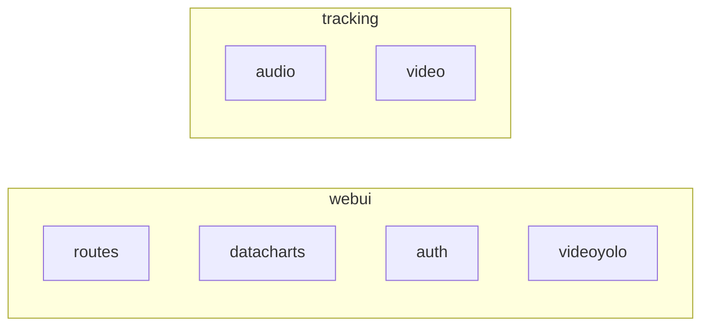

# Bird Identification Tool
[](https://www.python.org/downloads/release/python-3123/) 
[](https://github.com/preisem/Bird-Identification-Tool/actions/workflows/python-app.yml)
[](https://pypi.org/project/birdnetlib/)
[](https://pypi.org/project/nicegui/)
[](#)
[](#)

This tool is split into 2 main parts:
- Node (main.py): Nodes collect and analyze audio (and eventually video) and save bird detections to daily jsonl files
- Server (server.py): Webserver reads jsonl bird detection files created by nodes, displays data
## Install
```
sudo apt-get install v4l-utils -y
sudo apt-get install python3-pip -y
sudo apt-get install python3-virtualenv -y
python3 -m venv myvenv
source ./myvenv/bin/activate
python -m pip install -r requirements.txt
```

## QuickStart
### Node
  ```
  python node.py --camera 0 --mic sysdefault --location 42.0051 -74.2660 --recordings-directory path/to/folder --detections-directory path/to/folder --log-file-path path/to/folder 
  ```
### Server
  ```
  python server.py --detections-directory path/to/folder --log-file-path path/to/folder
  ```
## Import Notes
- check the audio device names using ```arecord -L```
- check the video device names using ```v4l2-ctl --list-devices```

## Endpoints
### Node
- ```:5000/<node_name>```: if --camera is provided, an endpoint with a stream of the camera is created based on the value of --node_name (default=default)
### Server
- ```:8000/```: this is the homepage with a daily dashboard display
- ```:8000/login```: login splash page, login is admin:password (obviously not production ready)
- ```:8000/analysis```: this page displays a table of the daily data, along with charts similar to v1 server
- ```:8000/video```: if any streams are provided with --video-streams, they will be displayed on this page
- ```:8000/readme```: page displaying the contents of the GitHub repo README.md 

## CMD Line Args
### Node
- ```--camera```: ```int``` X of camera device where device name = ```/dev/videoX``` This will create a local video stream with flask on port 5000 (optional)
- ```--mic```: ```str``` name of microphone device, can be found using command ```arecord -L```
- ```--location ```: ```float, tuple``` GPS location of devices using tuple such like: lat lon
- ```--node-name ```: ```str``` Name of node (optional)
- ```--min-confidence ```: ```float``` Minimum confidence of model for audio detection (default=0.2, range=0.0<x<1.0) (optional)
- ```--save-audio ```: ```str``` Choice to save audio recordings (always,never,detections-only, default=detections-only) (optional)
- ```--recordings-directory```: ```pathlib.Path``` path of directory to save audio recordings to (optional)
- ```--detections-directory```: ```pathlib.Path``` path of directory to save jsonl data of detected birds (optional)
- ```--log-file-path```: ```pathlib.Path``` parth to directory to save log files (optional)
### Server
- ```--detections-directory```: ```pathlib.Path``` path of directory to load jsonl data of detected birds (optional)
- ```--directory-wathcer```: ```pathlib.Path``` path to directory that the size in GB will be reported to the dashboard (optional)
- ```--video-streams```: ```str list``` space-delimited list of urls to live video streams that will be displayed on the /video page (optional)
- ```--log-file-path```: ```pathlib.Path``` parth to directory to save log files (optional)
- ```--authentication```: *WIP* turns on authentication with login page
- ```--analyze-video```: *WIP* turns on yolo processing on video streams, draws boxes around birds
- ```--model-path```: path to custom yolo model .pt file, default is yolov8n.pt (optional)
- ```--skip-frames```: ```int``` integer that skips n frames between analyzing (more skipped frames = better performance), default is 0 (optional)

## JSON Output Data Schema 
|field-name|data-type|description|example|
|----------|---------|-----------|-------|
|start_ts|datetime string|datetime string indicating start of detection|2024-12-02T11:43:41|
|end_ts|datetime string|datetime string indicating end of detection|2024-12-02T11:43:50|
|common_name|string|common name of detected bird|American Crow|
|scientific_name|string|scientific name of detected bird|Corvus brachyrhynchos|
|confidence|float|confidince of the detection|0.85435|
|location|string tuple '(float,float)'|location of the detection, expressed as a string tuple in format '(lat,lon)'|(42.01,-74.28)|
|node_name|string|name of node|backyard-1|
|filename|string pathlib.Path|filepath to audio file that the detection was made|sounds/2024-12-02-birdnet-11:43:35.wav|

## Internal Packages Structure
Some internal packages have been created to make the work flow a little cleaner. The server uses the ```webui``` package, while the node uses the ```tracking``` package.

## Video Stream Processing with YOLO
Optionaly video processing of incoming video streams can be turned on with ```--analyze-video```. This currently will use yolov8n or yolov8n draw boxes around objects. A model file to use can be specified using ```--model-path```. The model has not yet been trained on birds, but in the future my plan is to create and train a model on a custom dataset of bird photos. 
I have also added a the ability to frame skip with ```--skip-frames```, so that every nth frame is processed, while leaving previous detections drawn. The benift of this is that it reduces processing power and makes the stream less laggy on lightweight hardware. 
The code for this lives in ```webui/videoyolo.py```

## Training a Custom Bird Model
I have currated images of the top 100 birds in New York. I am using ```https://universe.roboflow.com/``` to label all the images with boxes. Then that data is used to make a ```data.yaml```, which is used to train a new model. This model currently does not work, as it needs more validation and test data.